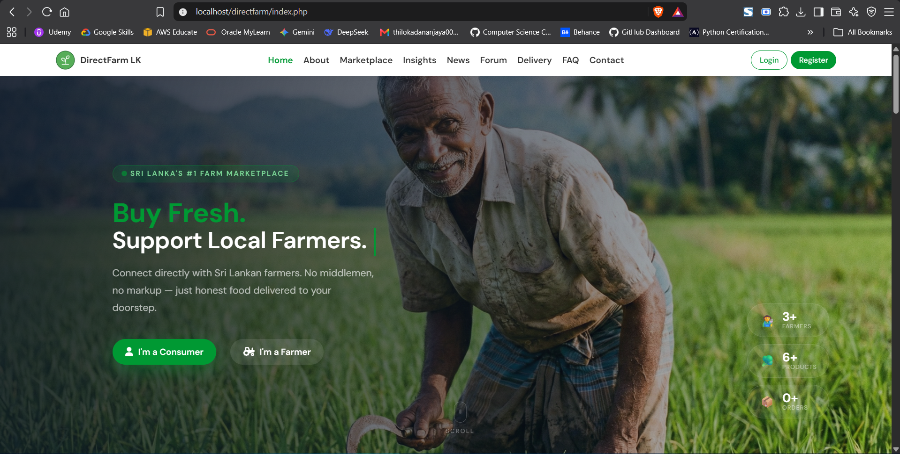
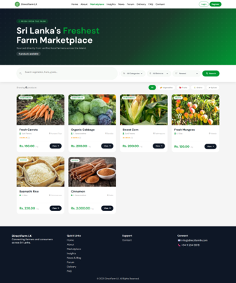
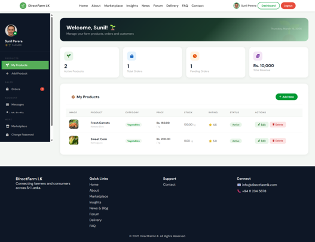
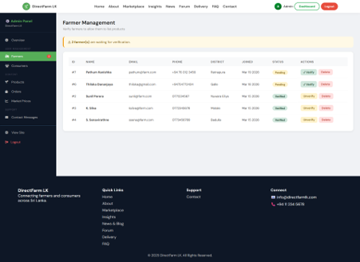

# 🌾 DirectFarm LK — Fresh From Farm to You

<p align="center">
  
</p>

<p align="center">
  
  
  
  
  
</p>

<p align="center">
  A full-stack web platform connecting Sri Lankan farmers directly with consumers — eliminating middlemen and ensuring fair prices for agricultural produce.
</p>

---

## 📌 Table of Contents

- [About the Project](#-about-the-project)
- [Features](#-features)
- [Tech Stack](#-tech-stack)
- [Database Schema](#-database-schema)
- [Project Structure](#-project-structure)
- [Getting Started](#-getting-started)
- [User Roles & Credentials](#-user-roles--test-credentials)
- [Team & Task Allocation](#-team--task-allocation)
- [Screenshots](#-screenshots)

---

## 📖 About the Project

**DirectFarm LK** is a group project developed as part of the BSc Honours in Computer Science and Technology at **Sabaragamuwa University of Sri Lanka**.

The platform allows **farmers** to list their agricultural products directly, **consumers** to browse and purchase fresh produce, and **admins** to manage and verify the platform — all without a middleman.

---

## ✨ Features

### 👨‍🌾 Farmer
- Register and get verified by admin
- Add, edit, and delete product listings with image uploads
- Manage incoming orders and update order status
- View earnings and order history
- Profile management

### 🛒 Consumer
- Browse marketplace with filters (category, district, rating, price)
- Add to cart and checkout
- Zone-based delivery fee calculation (Colombo = Rs.150, Upcountry = Rs.200, North/East = Rs.300)
- Free delivery on orders above Rs.1000
- Real-time order tracking
- Leave product reviews and ratings

### 🔧 Admin
- Verify and suspend farmer accounts
- Toggle product availability
- View platform-wide statistics
- Reply to contact messages
- Manage all users and products

### 🌐 Public Pages
- **Marketplace** — filterable product listings
- **Community Forum** — posts, replies, and categories
- **Market Insights** — live price trends from farmer listings
- **Logistics** — track any order by ID + email (no login needed)
- **News & Blog** — agricultural news
- **FAQ & Contact** — help and support

---

## 🛠 Tech Stack

| Layer | Technology |
|-------|-----------|
| Backend | PHP 8.3 |
| Database | MySQL 8 |
| Frontend | HTML5, CSS3, JavaScript |
| Server | Apache (XAMPP) |
| DB Admin | phpMyAdmin |
| Auth | PHP Sessions + bcrypt |

---

## 🗄 Database Schema

8 core tables:

```
users           — farmers, consumers, admins (role-based)
products        — farmer product listings
orders          — consumer orders
order_items     — individual items per order
cart            — consumer cart items
reviews         — product ratings and comments
messages        — farmer-consumer messaging
market_prices   — price trend data for insights page
```

**Key design decisions:**
- All passwords hashed with `password_hash()` (bcrypt)
- Prepared statements used throughout — no raw SQL injection risk
- Foreign keys with `ON DELETE CASCADE` for data integrity
- Single `users` table for all roles — role ENUM field controls access

---

## 📁 Project Structure

```
directfarm/
├── admin/
│   └── dashboard.php          # Admin control panel
├── consumer/
│   ├── dashboard.php          # Consumer profile & orders
│   ├── cart.php               # Shopping cart
│   ├── checkout.php           # Checkout with delivery zones
│   ├── order_detail.php       # Order details
│   └── order_success.php      # Order confirmation
├── farmer/
│   └── dashboard.php          # Farmer products & orders
├── includes/
│   ├── config.php             # DB config, helper functions
│   ├── auth.php               # Login, register, OTP reset
│   ├── navbar.php             # Shared navigation
│   └── product.php            # Product helpers
├── uploads/                   # Product & profile images
├── index.php                  # Home page
├── marketplace.php            # Product listings
├── forum.php                  # Community forum
├── insights.php               # Market price trends
├── logistics.php              # Order tracking
├── about.php                  # About page
├── contactus.php              # Contact form
├── faq.php                    # FAQ page
├── news.php                   # News & blog
├── change_password.php        # Password management
└── database.sql               # Full database schema + seed data
```

---

## 🚀 Getting Started

### Prerequisites
- [XAMPP](https://www.apachefriends.org/) (PHP 8.0+ and MySQL)

### Installation

1. **Clone the repository**
```bash
git clone https://github.com/yourusername/directfarm-lk.git
```

2. **Move to XAMPP's htdocs folder**
```bash
mv directfarm-lk C:/xampp/htdocs/directfarm
```

3. **Start XAMPP**
   - Open XAMPP Control Panel
   - Start **Apache** and **MySQL**

4. **Set up the database**
   - Go to `http://localhost/phpmyadmin`
   - Create a new database named `directfarm_lk`
   - Click **Import** → select `database.sql` → click **Go**

5. **Configure the project**

   Open `includes/config.php` and update:
   ```php
   define('DB_HOST', 'localhost');
   define('DB_USER', 'root');
   define('DB_PASS', '');
   define('DB_NAME', 'directfarm_lk');
   define('BASE_URL', 'http://localhost/directfarm/');
   ```

6. **Open in browser**
```
http://localhost/directfarm/
```

---

## 👥 User Roles & Test Credentials

| Role | Email | Password |
|------|-------|----------|
| Admin | admin@directfarmlk.com | password |
| Farmer | sunil@farm.com | password |
| Farmer | ksilva@farm.com | password |
| Consumer | kamal@gmail.com | password |

---

## 👨‍💻 Team & Task Allocation

This project was developed by a team of 4 students from Sabaragamuwa University of Sri Lanka.

| Student | Pages | Backend Responsibilities |
|---------|-------|--------------------------|
| **K.C.I De Silva** | Home, Login, Consumer Register, Consumer Dashboard, Marketplace, Product Details | Consumer login, Product fetching, Marketplace display |
| **I.Y.S Jayaweera** | Farmer Register, Farmer Dashboard, Product Management, Farmer Orders, Community Forum | Farmer login, CRUD on products, Order handling |
| **A.P.K Jayaweera** | About, Logistics, Market Insights, News & Blog | Delivery system, Insights analytics, Blog management |
| **D.G.T.D Abeysekara** | Help & FAQ, Contact, Admin Panel | Database design, Admin verification, Security, Role management, API testing |

---

## 📸 Screenshots

> Add your screenshots to a `/screenshots` folder and they will appear here.

| Home Page | Marketplace |
|-----------|------------|
|  |  |

| Farmer Dashboard | Admin Panel |
|-----------------|------------|
|  |  |

---

## 🔐 Security Features

- Passwords hashed with **bcrypt** (`password_hash` / `password_verify`)
- All inputs sanitized via `clean()` helper (`htmlspecialchars + strip_tags + trim`)
- **Prepared statements** throughout — SQL injection protected
- Role-based access control via PHP sessions
- OTP-based password reset (6-digit, 10-minute expiry)
- Admin cannot delete their own account

---

## 📄 License

This project was developed for academic purposes at Sabaragamuwa University of Sri Lanka.

---


